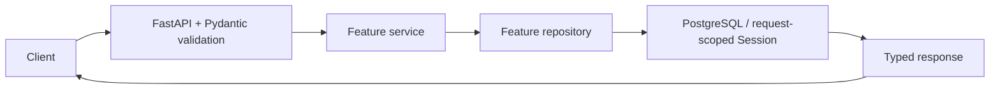

# WWML-101 — REST API v1

Version 1.0 · 2026-09-22

Implementation baseline: `f82655903a5e8b107e7bbbd93dbe9372cc66bfe9` (PR #12).
This describes that branch, not a claim that the PR stack is merged or deployed.

## Contract and request flow

[Application composition](../../backend/app/main.py) registers the routers.
Live contracts are at `/openapi.json`; Swagger is at `/docs`.
Canonical application endpoints use `/api/v1`. Health and existing Drive
integrations are unversioned. Deprecated `/assets` CRUD/search routes share the
registry implementation; there is no `/assets/statistics` alias.

Registry and planning services commit writes explicitly. The session dependency
rolls back exceptions and closes sessions. The legacy Drive progress router queries
directly. Next.js uses the internal backend URL server-side; its current asset
pages still call the legacy routes.

There is no application login, JWT issuance, API-key enforcement, RBAC or tenant
isolation. Google credentials authenticate the server to Google, not callers to
WWML. See [architecture decisions](WWML-Architecture-Decisions.md).

## Common behavior

- UUID identifiers and ISO 8601 timestamps; persisted times use timezone-aware columns.
- Versioned lists return items, total, page, page_size, total_pages.
  Page defaults to 1 (maximum 1,000,000); page_size defaults to 20 (range 1–100).
- Empty collections have zero total_pages. Out-of-range pages retain the filtered
  total and return empty items. Offset pagination is not a transactional snapshot.
- The older Drive import list omits total_pages and has no maximum page number.
- Invalid input returns 422. Versioned query models reject unknown query parameters.
- Registry/planning errors use `{"detail":{"code":"...","message":"..."}}`.
  Registry conflicts include existing_asset_id. Drive progress lookup instead
  returns `{"detail":"Import not found"}` on 404.

## Asset Registry

POST requires name, storage_uri, media_type, mime_type, size_bytes and sha256.
Description and asset_metadata are optional. It registers an existing file's
metadata; it does not upload or generate media. See
[metadata contract](WWML-103-Asset-Metadata-v1.md).

GET collection and GET search share these parameters:

| Parameter | Behavior |
| --- | --- |
| q | Trimmed literal case-insensitive name/description substring, 1–200 characters |
| media_type, mime_type, sha256 | Exact filters |
| min_size_bytes, max_size_bytes | Inclusive nonnegative byte bounds |
| created_after, created_before | Inclusive bounds requiring timezone-aware timestamps |
| sort_by | created_at (default), updated_at, name, size_bytes |
| sort_order | desc (default), asc |
| page, page_size | Bounded pagination |

Filters combine with AND; q matches either name or description. UUID breaks
ordering ties in the selected direction. Name sorting is case-insensitive.
Normal reads/search/statistics exclude soft-deleted records.

POST returns 201 and Location. Duplicate SHA-256 returns 409 duplicate_asset;
a tombstone's reserved checksum returns 409 asset_deleted.
PATCH requires at least one field; omitted fields stay unchanged, only description
accepts null, and asset_metadata replaces the complete object.
DELETE sets deleted_at and returns 204; source bytes remain. Subsequent
GET/PATCH/DELETE returns 404. No restore endpoint exists.

## Dashboard, productions and synchronization

Dashboard returns assets, productions, sync_jobs. Asset statistics expose
total_assets, total_size_bytes and by_media_type, with count/size_bytes for all five
media types, including zero groups. Bytes represent registered logical sizes,
not measured disk use. Production/sync summaries have total and by_status.

Production list statuses: draft, in_production, completed, archived.
Order: created_at DESC, id DESC. Sync list statuses: pending, running, completed,
completed_with_errors, failed. Order: started_at DESC NULLS LAST, id DESC.
Both support optional status and standard pagination. Sync items expose all eight
sync_jobs fields. The importer does not yet populate sync_jobs.
Summary queries read committed data separately; concurrent writes can affect totals.

## Production hierarchy and locks

POST productions accepts name, optional description and status (default draft).
Children require name and a positive position; description is optional.
Required assets also require media_type. Positions are unique among siblings
(409 position_conflict); lists order position ASC then UUID. Missing parents return
404, while existing parents with no children return empty pages.

PUT a requirement's locked-asset with `{"asset_id":"<UUID>"}`. The first selection
must be active and match the required media type. Responses contain
required_asset_id, asset_id, checksum, storage_uri and locked_at.
Same-asset retries retain the original snapshot. Another asset returns
409 already_locked; a media mismatch returns 409 media_type_mismatch.
DELETE explicitly unlocks (204, including an already-unlocked existing requirement).
GET an unfilled lock returns 404. Registry edits/soft deletion preserve existing
snapshots. Row locks serialize choices and snapshot capture.

Hierarchy creation and reading are implemented; node editing/moving/deletion,
batch selection and lock audit history are not. See
[planning guide](../../backend/docs/production-planning.md).

## Health and existing integrations

GET /health returns `{"status":"healthy"}`. GET /health/ready checks PostgreSQL and
Redis, returning 503 on dependency failure; it does not verify migrations or Drive.

Drive files accepts recursive (default true), scans only the configured folder,
and returns folder_id, recursive, total_files, files. It uses configured scan limits,
not client pagination; shortcuts are reported, never followed. It is metadata-only.
Its documented errors include 403/404/413/502/503/504.

Drive import progress supports status, page and page_size. States: watch, import,
rename, register, done, failed, skipped. The worker is opt-in; no HTTP route starts
a synchronization run. See [backend guide](../../backend/README.md).

## Verified endpoint inventory

Generated from the baseline application OpenAPI schema, excluding framework docs routes.

| Method | Path | Success response |
| --- | --- | --- |
| GET | `/health` | 200 HealthResponse |
| GET | `/health/ready` | 200 ReadinessResponse |
| GET | `/integrations/google-drive/imports` | 200 ImportPage |
| GET | `/integrations/google-drive/imports/{import_id}` | 200 ImportRead |
| GET | `/api/v1/dashboard` | 200 DashboardResponse |
| GET | `/api/v1/assets/statistics` | 200 AssetStatistics |
| GET | `/api/v1/productions` | 200 Page_ProductionResponse_ |
| POST | `/api/v1/productions` | 201 ProductionResponse |
| GET | `/api/v1/sync/jobs` | 200 Page_SyncJobResponse_ |
| GET | `/api/v1/productions/{production_id}` | 200 ProductionResponse |
| POST | `/api/v1/productions/{production_id}/sequences` | 201 SequenceResponse |
| GET | `/api/v1/productions/{production_id}/sequences` | 200 Page_SequenceResponse_ |
| POST | `/api/v1/sequences/{sequence_id}/scenes` | 201 SceneResponse |
| GET | `/api/v1/sequences/{sequence_id}/scenes` | 200 Page_SceneResponse_ |
| POST | `/api/v1/scenes/{scene_id}/shots` | 201 ShotResponse |
| GET | `/api/v1/scenes/{scene_id}/shots` | 200 Page_ShotResponse_ |
| POST | `/api/v1/shots/{shot_id}/required-assets` | 201 RequirementResponse |
| GET | `/api/v1/shots/{shot_id}/required-assets` | 200 Page_RequirementResponse_ |
| PUT | `/api/v1/required-assets/{requirement_id}/locked-asset` | 200 LockResponse |
| GET | `/api/v1/required-assets/{requirement_id}/locked-asset` | 200 LockResponse |
| DELETE | `/api/v1/required-assets/{requirement_id}/locked-asset` | 204 no body |
| POST | `/api/v1/assets` | 201 AssetResponse |
| GET | `/api/v1/assets` | 200 AssetPage |
| GET | `/api/v1/assets/search` | 200 AssetPage |
| GET | `/api/v1/assets/{asset_id}` | 200 AssetResponse |
| PATCH | `/api/v1/assets/{asset_id}` | 200 AssetResponse |
| DELETE | `/api/v1/assets/{asset_id}` | 204 no body |
| POST (deprecated) | `/assets` | 201 AssetResponse |
| GET (deprecated) | `/assets` | 200 AssetPage |
| GET (deprecated) | `/assets/search` | 200 AssetPage |
| GET (deprecated) | `/assets/{asset_id}` | 200 AssetResponse |
| PATCH (deprecated) | `/assets/{asset_id}` | 200 AssetResponse |
| DELETE (deprecated) | `/assets/{asset_id}` | 204 no body |
| GET | `/integrations/google-drive/files` | 200 FolderReadResponse |

## Maintenance

Update this contract with route changes, compare it with create_app().openapi(),
and run API tests. Versioned filenames alone do not guarantee API compatibility.
