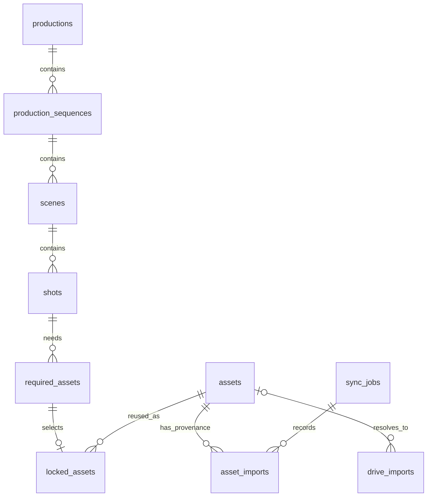

# WWML-102 — Database ERD v1

Version 1.0 · 2026-09-22

Implementation baseline: `f82655903a5e8b107e7bbbd93dbe9372cc66bfe9` (PR #12).
The ten application tables below describe the branch, not deployment status.

## Relationships

PostgreSQL stores canonical metadata and planning records. Files live outside the
database. Redis is not the source of truth for these entities.
Models: [app/models](../../backend/app/models/__init__.py).
Migrations: [alembic/versions](../../backend/alembic/versions).
Alembic's version table is bookkeeping and is omitted from this ERD.

Each child has exactly one parent; parents may initially have no children.
Requirements have zero or one lock. Assets can serve many requirements.
A Drive progress record may have no resolved asset.

## Data dictionary

Types, nullability, keys and SQL defaults below are derived from registered
SQLAlchemy metadata. UUIDs generated by Python are not database defaults;
raw SQL inserts must supply IDs.

### assets

| Column | PostgreSQL type | Nullable | Keys / SQL default |
| --- | --- | --- | --- |
| id | UUID | no | PK |
| name | VARCHAR(255) | no | — |
| description | TEXT | yes | — |
| storage_uri | TEXT | no | — |
| media_type | VARCHAR(16) | no | — |
| mime_type | VARCHAR(127) | no | — |
| size_bytes | BIGINT | no | — |
| sha256 | VARCHAR(64) | no | UNIQUE |
| asset_metadata | JSONB | no | default `'{}'::jsonb` |
| deleted_at | TIMESTAMP WITH TIME ZONE | yes | — |
| created_at | TIMESTAMP WITH TIME ZONE | no | default `now()` |
| updated_at | TIMESTAMP WITH TIME ZONE | no | default `now()` |

### productions

| Column | PostgreSQL type | Nullable | Keys / SQL default |
| --- | --- | --- | --- |
| id | UUID | no | PK |
| name | VARCHAR(255) | no | — |
| description | TEXT | yes | — |
| status | VARCHAR(32) | no | default `draft` |
| created_at | TIMESTAMP WITH TIME ZONE | no | default `now()` |
| updated_at | TIMESTAMP WITH TIME ZONE | no | default `now()` |

### sync_jobs

| Column | PostgreSQL type | Nullable | Keys / SQL default |
| --- | --- | --- | --- |
| id | UUID | no | PK |
| status | VARCHAR(32) | no | default `pending` |
| started_at | TIMESTAMP WITH TIME ZONE | yes | — |
| completed_at | TIMESTAMP WITH TIME ZONE | yes | — |
| files_scanned | BIGINT | no | default `0` |
| files_imported | BIGINT | no | default `0` |
| files_skipped | BIGINT | no | default `0` |
| errors | JSONB | no | default `'[]'::jsonb` |

### asset_imports

| Column | PostgreSQL type | Nullable | Keys / SQL default |
| --- | --- | --- | --- |
| asset_id | UUID | no | FK → assets.id; ON DELETE RESTRICT |
| google_drive_file_id | VARCHAR(256) | no | PK |
| checksum | VARCHAR(64) | no | — |
| import_date | TIMESTAMP WITH TIME ZONE | no | default `now()` |
| sync_job_id | UUID | no | PK; FK → sync_jobs.id; ON DELETE RESTRICT |

### drive_imports

| Column | PostgreSQL type | Nullable | Keys / SQL default |
| --- | --- | --- | --- |
| id | UUID | no | PK |
| file_id | VARCHAR(256) | no | — |
| source_version | VARCHAR(256) | no | — |
| source_name | VARCHAR(1024) | no | — |
| status | VARCHAR(16) | no | — |
| attempts | INTEGER | no | — |
| error_code | VARCHAR(64) | yes | — |
| asset_id | UUID | yes | FK → assets.id; ON DELETE SET NULL |
| created_at | TIMESTAMP WITH TIME ZONE | no | default `now()` |
| updated_at | TIMESTAMP WITH TIME ZONE | no | default `now()` |

### production_sequences

| Column | PostgreSQL type | Nullable | Keys / SQL default |
| --- | --- | --- | --- |
| production_id | UUID | no | FK → productions.id; ON DELETE RESTRICT |
| id | UUID | no | PK |
| name | VARCHAR(255) | no | — |
| description | TEXT | yes | — |
| position | INTEGER | no | — |
| created_at | TIMESTAMP WITH TIME ZONE | no | default `now()` |

### scenes

| Column | PostgreSQL type | Nullable | Keys / SQL default |
| --- | --- | --- | --- |
| sequence_id | UUID | no | FK → production_sequences.id; ON DELETE RESTRICT |
| id | UUID | no | PK |
| name | VARCHAR(255) | no | — |
| description | TEXT | yes | — |
| position | INTEGER | no | — |
| created_at | TIMESTAMP WITH TIME ZONE | no | default `now()` |

### shots

| Column | PostgreSQL type | Nullable | Keys / SQL default |
| --- | --- | --- | --- |
| scene_id | UUID | no | FK → scenes.id; ON DELETE RESTRICT |
| id | UUID | no | PK |
| name | VARCHAR(255) | no | — |
| description | TEXT | yes | — |
| position | INTEGER | no | — |
| created_at | TIMESTAMP WITH TIME ZONE | no | default `now()` |

### required_assets

| Column | PostgreSQL type | Nullable | Keys / SQL default |
| --- | --- | --- | --- |
| shot_id | UUID | no | FK → shots.id; ON DELETE RESTRICT |
| media_type | VARCHAR(16) | no | — |
| id | UUID | no | PK |
| name | VARCHAR(255) | no | — |
| description | TEXT | yes | — |
| position | INTEGER | no | — |
| created_at | TIMESTAMP WITH TIME ZONE | no | default `now()` |

### locked_assets

| Column | PostgreSQL type | Nullable | Keys / SQL default |
| --- | --- | --- | --- |
| required_asset_id | UUID | no | PK; FK → required_assets.id; ON DELETE RESTRICT |
| asset_id | UUID | no | FK → assets.id; ON DELETE RESTRICT |
| checksum | VARCHAR(64) | no | — |
| storage_uri | TEXT | no | — |
| locked_at | TIMESTAMP WITH TIME ZONE | no | default `now()` |

## Constraints and deletion

| Entity | Enforced rules |
| --- | --- |
| assets | Unique lowercase 64-hex SHA-256 including tombstones; nonnegative size; nonblank name/URI; valid media type |
| productions | Nonblank name; draft/in_production/completed/archived status |
| sequences, scenes, shots | Positive position; unique parent/position; nonblank name |
| required_assets | Same ordering rules plus valid media type |
| locked_assets | One row per requirement; valid checksum and nonblank URI |
| sync_jobs | Valid lifecycle; nonnegative counters; imported + skipped ≤ scanned; errors is a JSON array |
| asset_imports | Composite PK (sync_job_id, google_drive_file_id); valid Drive identifier and checksum |
| drive_imports | Unique file_id/source_version; nonnegative attempts; valid workflow status |

Sync jobs: pending has no timestamps; running requires started_at only; terminal
states require both timestamps with completed_at ≥ started_at. Error-array length
is not a failed-file count.

Soft deletion retains assets and checksum reservations. Import/lock checksums
remain historical snapshots after registry metadata changes.
Hierarchy, lock and provenance FKs use ON DELETE RESTRICT.
The older drive_imports.asset_id uses SET NULL for physical deletion; registry
soft deletion does not trigger that action.

Active asset state and media compatibility at lock time are service rules, not
cross-table CHECK constraints. The database cannot verify bytes at a storage URI.
JSON metadata has no database-enforced technical/rights schema.

## Indexes

Assets have a unique checksum and created_at/id, media_type/created_at/id,
mime_type/created_at/id indexes, plus a partial active created_at/id index.
Productions use created_at/id. Each ordered child has a unique parent/position
index. Locks have the requirement PK and an asset_id index.
Sync jobs use started_at/id. Provenance has asset_id/import_date and
google_drive_file_id/import_date indexes plus the composite PK.
Drive progress has source/version uniqueness and created_at/id.

Substring asset search has no full-text, trigram or vector index.

## Migration chain

| Revision | Addition |
| --- | --- |
| 0001_create_assets | Assets |
| 0002_asset_discovery | Discovery indexes |
| 0003_drive_imports | Per-file progress |
| 0004_asset_soft_delete | Tombstones |
| 0005_sync_jobs | Run history |
| 0006_asset_imports | Provenance |
| 0007_productions | Productions |
| 0008_production_structure | Hierarchy, requirements and locks |

Apply alembic upgrade head; Compose startup applies migrations.
Downgrades remove records introduced by removed revisions.
There is no backfill into sync_jobs or asset_imports; the worker currently writes
assets and drive_imports only. PostgreSQL CI verifies constraints, migration
round trips and metadata consistency.
